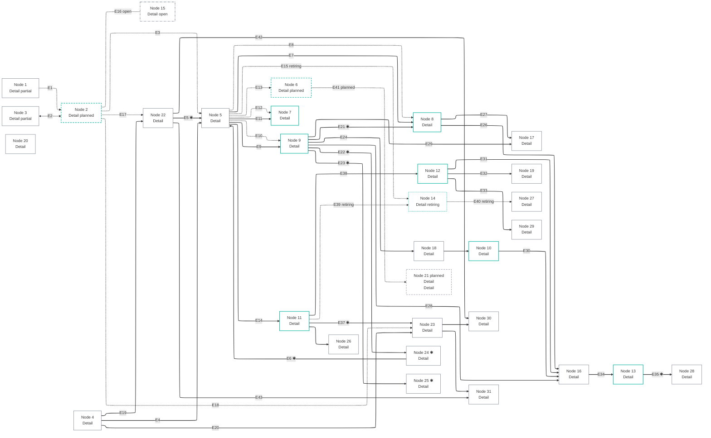
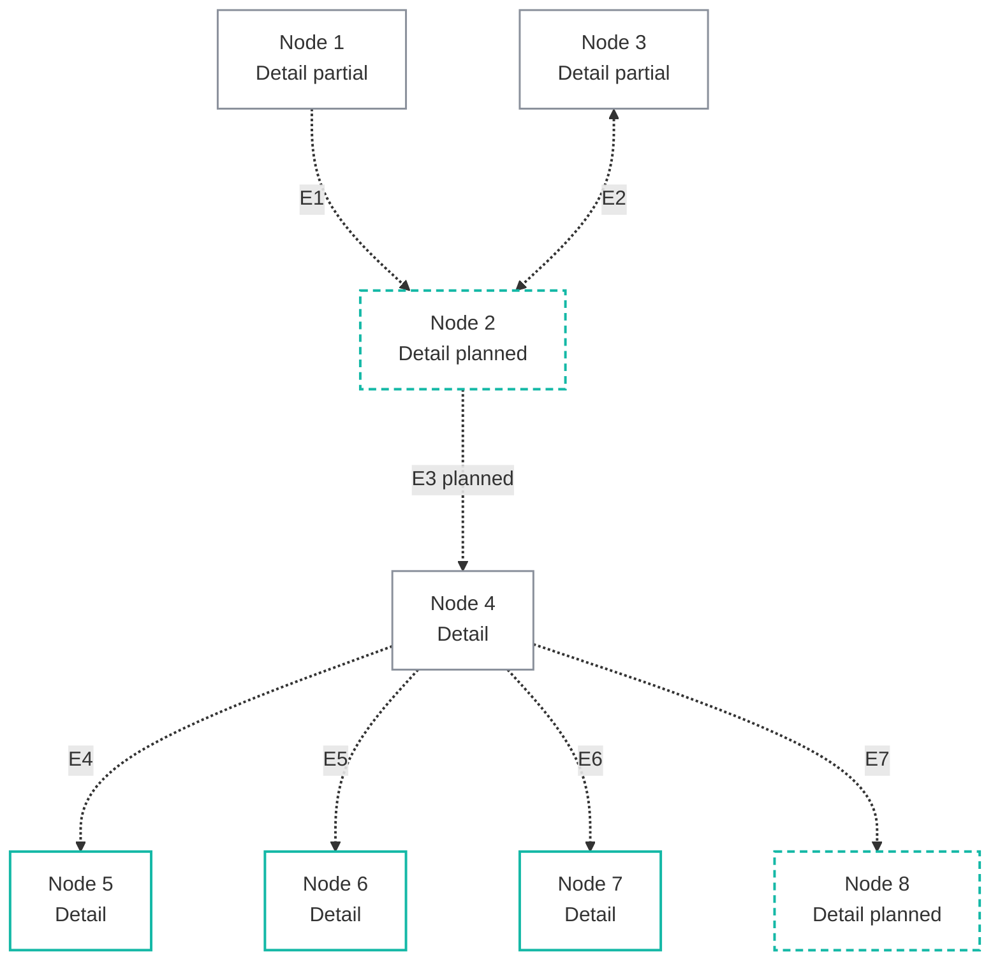
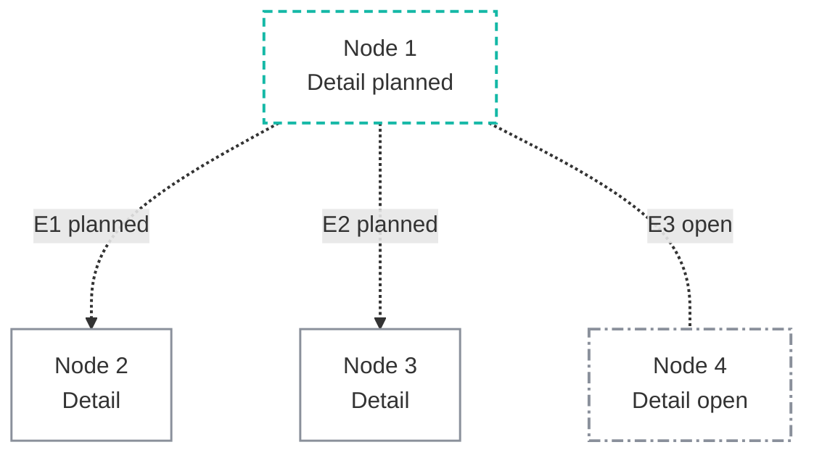
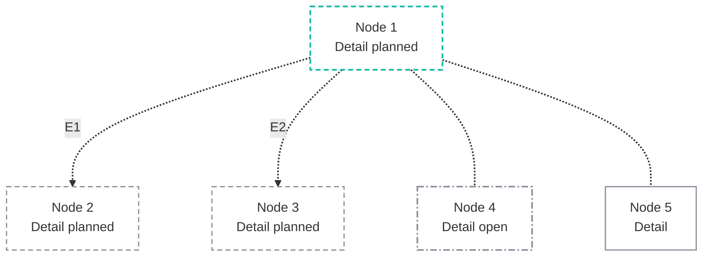
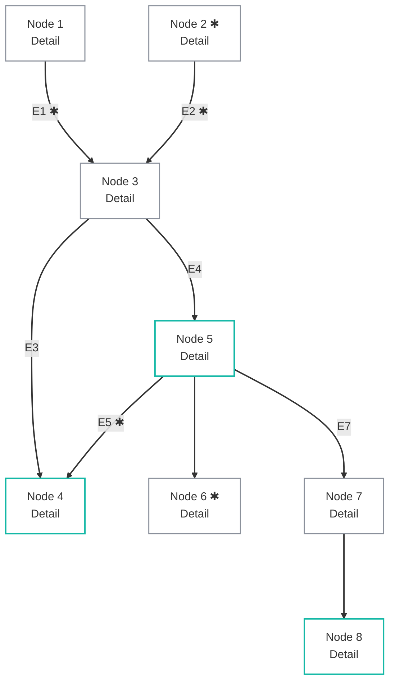
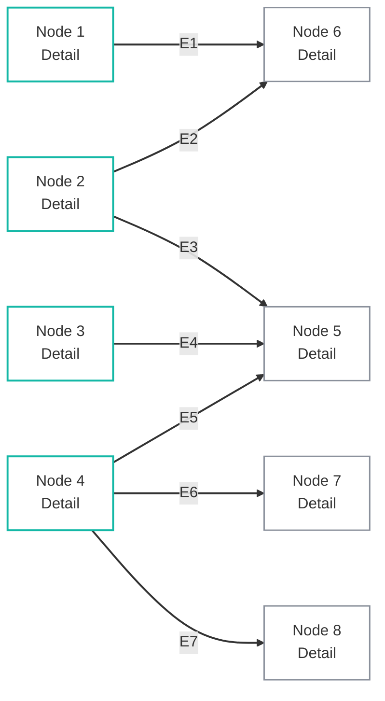
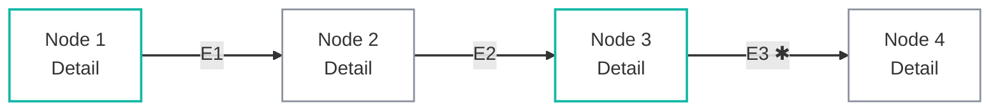
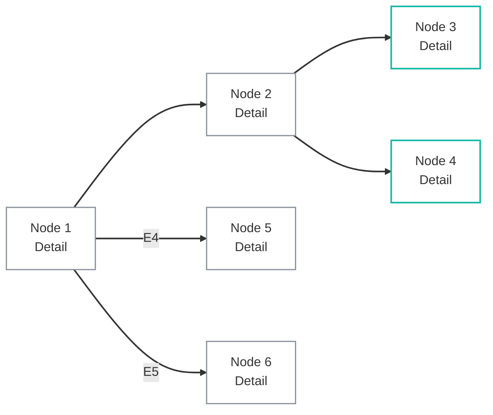
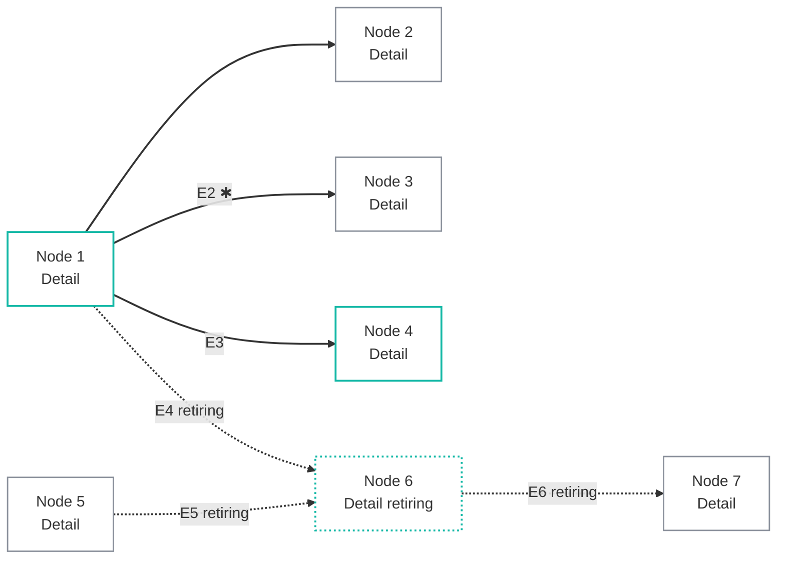

# Nine flowchart views

```mermaid
---
config:
  layout: elk
  flowchart:
    nodeSpacing: 60
    rankSpacing: 70
---
flowchart LR
  accTitle: Diagram 1
  accDescr: Connections in diagram 1.
  N1["Node 1<br/>Detail partial"]:::tone6
  N2["Node 2<br/>Detail planned"]:::tone3
  N3["Node 3<br/>Detail partial"]:::tone6
  N4["Node 4<br/>Detail"]:::tone1
  N5["Node 5<br/>Detail"]:::tone1
  N6["Node 6<br/>Detail planned"]:::tone3
  N7["Node 7<br/>Detail"]:::tone2
  N8["Node 8<br/>Detail"]:::tone2
  N9["Node 9<br/>Detail"]:::tone2
  N10["Node 10<br/>Detail"]:::tone2
  N11["Node 11<br/>Detail"]:::tone2
  N12["Node 12<br/>Detail"]:::tone2
  N13["Node 13<br/>Detail"]:::tone2
  N14["Node 14<br/>Detail retiring"]:::tone4
  N15["Node 15<br/>Detail open"]:::tone7
  N16["Node 16<br/>Detail"]:::tone1
  N17["Node 17<br/>Detail"]:::tone1
  N18["Node 18<br/>Detail"]:::tone1
  N19["Node 19<br/>Detail"]:::tone1
  N20["Node 20<br/>Detail"]:::tone1
  N21["Node 21 planned<br/>Detail<br/>Detail"]:::tone5
  N22["Node 22<br/>Detail"]:::tone1
  N23["Node 23<br/>Detail"]:::tone1
  N24["Node 24 ✱<br/>Detail"]:::tone1
  N25["Node 25 ✱<br/>Detail"]:::tone1
  N26["Node 26<br/>Detail"]:::tone1
  N27["Node 27<br/>Detail"]:::tone1
  N28["Node 28<br/>Detail"]:::tone1
  N29["Node 29<br/>Detail"]:::tone1
  N30["Node 30<br/>Detail"]:::tone1
  N31["Node 31<br/>Detail"]:::tone1
  N1 -.->|"E1"| N2
  N3 <-.->|"E2"| N2
  N2 -.->|"E3"| N5
  N4 -->|"E4"| N5
  N22 -->|"E5 ✱"| N5
  N24 -->|"E6 ✱"| N5
  N5 -->|"E7"| N8
  N5 -.->|"E8"| N8
  N5 -->|"E9"| N9
  N5 -.->|"E10"| N9
  N5 -->|"E11"| N7
  N5 -.->|"E12"| N7
  N5 -.->|"E13"| N6
  N5 -->|"E14"| N11
  N5 -.->|"E15 retiring"| N14
  N2 -.-|"E16 open"| N15
  N2 -.->|"E17"| N22
  N2 -.->|"E18"| N23
  N4 -->|"E19"| N22
  N4 -->|"E20"| N23
  N9 -->|"E21 ✱"| N8
  N9 -->|"E22 ✱"| N24
  N9 -->|"E23 ✱"| N25
  N9 -->|"E24"| N18
  N18 --> N10
  N8 -->|"E26"| N16
  N8 -->|"E27"| N17
  N9 -->|"E28"| N16
  N9 -->|"E29"| N17
  N10 -->|"E30"| N16
  N12 -->|"E31"| N16
  N12 -->|"E32"| N19
  N12 -->|"E33"| N29
  N16 -->|"E34"| N13
  N13 -->|"E35 ✱"| N28
  N11 --> N26
  N11 -->|"E37 ✱"| N23
  N11 -->|"E38"| N12
  N11 -.->|"E39 retiring"| N14
  N14 -.->|"E40 retiring"| N27
  N6 -.->|"E41 planned"| N21
  N22 -->|"E42"| N30
  N22 -->|"E43"| N31
  N23 --> N30
  N23 --> N31
  linkStyle default stroke-width:2px
  classDef tone1 fill:transparent,stroke:#8a909b,stroke-width:1.5px
  classDef tone2 fill:transparent,stroke:#14b8a6,stroke-width:2px
  classDef tone3 fill:transparent,stroke:#14b8a6,stroke-width:2px,stroke-dasharray:6 4
  classDef tone4 fill:transparent,stroke:#14b8a6,stroke-width:2px,stroke-dasharray:2 3
  classDef tone5 fill:transparent,stroke:#8a909b,stroke-width:1.5px,stroke-dasharray:6 4
  classDef tone6 fill:transparent,stroke:#8a909b,stroke-width:1.5px
  classDef tone7 fill:transparent,stroke:#8a909b,stroke-width:2px,stroke-dasharray:8 3 2 3

```

```mermaid
---
config:
  flowchart:
    nodeSpacing: 90
    rankSpacing: 120
---
flowchart TB
  accTitle: Diagram 2
  accDescr: Connections in diagram 2.
  N1["Node 1<br/>Detail partial"]:::tone4
  N2["Node 2<br/>Detail planned"]:::tone3
  N3["Node 3<br/>Detail partial"]:::tone4
  N4["Node 4<br/>Detail"]:::tone1
  N5["Node 5<br/>Detail"]:::tone2
  N6["Node 6<br/>Detail"]:::tone2
  N7["Node 7<br/>Detail"]:::tone2
  N8["Node 8<br/>Detail planned"]:::tone3
  N1 -.->|"E1"| N2
  N3 <-.->|"E2"| N2
  N2 -.->|"E3 planned"| N4
  N4 -.->|"E4"| N5
  N4 -.->|"E5"| N6
  N4 -.->|"E6"| N7
  N4 -.->|"E7"| N8
  linkStyle default stroke-width:2px
  classDef tone1 fill:transparent,stroke:#8a909b,stroke-width:1.5px
  classDef tone2 fill:transparent,stroke:#14b8a6,stroke-width:2px
  classDef tone3 fill:transparent,stroke:#14b8a6,stroke-width:2px,stroke-dasharray:6 4
  classDef tone4 fill:transparent,stroke:#8a909b,stroke-width:1.5px
```

```mermaid
---
config:
  flowchart:
    nodeSpacing: 90
    rankSpacing: 120
---
flowchart TB
  accTitle: Diagram 3
  accDescr: Connections in diagram 3.
  N1["Node 1<br/>Detail planned"]:::tone2
  N2["Node 2<br/>Detail"]:::tone1
  N3["Node 3<br/>Detail"]:::tone1
  N4["Node 4<br/>Detail open"]:::tone3
  N1 -.->|"E1 planned"| N2
  N1 -.->|"E2 planned"| N3
  N1 -.-|"E3 open"| N4
  linkStyle default stroke-width:2px
  classDef tone1 fill:transparent,stroke:#8a909b,stroke-width:1.5px
  classDef tone2 fill:transparent,stroke:#14b8a6,stroke-width:2px,stroke-dasharray:6 4
  classDef tone3 fill:transparent,stroke:#8a909b,stroke-width:2px,stroke-dasharray:8 3 2 3
```

```mermaid
---
config:
  flowchart:
    nodeSpacing: 90
    rankSpacing: 120
---
flowchart TB
  accTitle: Diagram 4
  accDescr: Connections in diagram 4.
  N1["Node 1<br/>Detail planned"]:::tone3
  N2["Node 2<br/>Detail planned"]:::tone2
  N3["Node 3<br/>Detail planned"]:::tone2
  N4["Node 4<br/>Detail open"]:::tone4
  N5["Node 5<br/>Detail"]:::tone1
  N1 -.->|"E1"| N2
  N1 -.->|"E2"| N3
  N1 -.- N4
  N1 -.- N5
  linkStyle default stroke-width:2px
  classDef tone1 fill:transparent,stroke:#8a909b,stroke-width:1.5px
  classDef tone2 fill:transparent,stroke:#8a909b,stroke-width:1.5px,stroke-dasharray:6 4
  classDef tone3 fill:transparent,stroke:#14b8a6,stroke-width:2px,stroke-dasharray:6 4
  classDef tone4 fill:transparent,stroke:#8a909b,stroke-width:2px,stroke-dasharray:8 3 2 3
```

```mermaid
---
config:
  flowchart:
    nodeSpacing: 90
    rankSpacing: 120
---
flowchart TB
  accTitle: Diagram 5
  accDescr: Connections in diagram 5.
  N1["Node 1<br/>Detail"]:::tone1
  N2["Node 2 ✱<br/>Detail"]:::tone1
  N3["Node 3<br/>Detail"]:::tone1
  N4["Node 4<br/>Detail"]:::tone2
  N5["Node 5<br/>Detail"]:::tone2
  N6["Node 6 ✱<br/>Detail"]:::tone1
  N7["Node 7<br/>Detail"]:::tone1
  N8["Node 8<br/>Detail"]:::tone2
  N1 -->|"E1 ✱"| N3
  N2 -->|"E2 ✱"| N3
  N3 -->|"E3"| N4
  N3 -->|"E4"| N5
  N5 -->|"E5 ✱"| N4
  N5 --> N6
  N5 -->|"E7"| N7
  N7 --> N8
  linkStyle default stroke-width:2px
  classDef tone1 fill:transparent,stroke:#8a909b,stroke-width:1.5px
  classDef tone2 fill:transparent,stroke:#14b8a6,stroke-width:2px
```

```mermaid
---
config:
  flowchart:
    nodeSpacing: 80
    rankSpacing: 140
---
flowchart LR
  accTitle: Diagram 6
  accDescr: Connections in diagram 6.
  N1["Node 1<br/>Detail"]:::tone2
  N2["Node 2<br/>Detail"]:::tone2
  N3["Node 3<br/>Detail"]:::tone2
  N4["Node 4<br/>Detail"]:::tone2
  N5["Node 5<br/>Detail"]:::tone1
  N6["Node 6<br/>Detail"]:::tone1
  N7["Node 7<br/>Detail"]:::tone1
  N8["Node 8<br/>Detail"]:::tone1
  N1 -->|"E1"| N6
  N2 -->|"E2"| N6
  N2 -->|"E3"| N5
  N3 -->|"E4"| N5
  N4 -->|"E5"| N5
  N4 -->|"E6"| N7
  N4 -->|"E7"| N8
  linkStyle default stroke-width:2px
  classDef tone1 fill:transparent,stroke:#8a909b,stroke-width:1.5px
  classDef tone2 fill:transparent,stroke:#14b8a6,stroke-width:2px
```

```mermaid
---
config:
  flowchart:
    nodeSpacing: 90
    rankSpacing: 100
---
flowchart LR
  accTitle: Diagram 7
  accDescr: Connections in diagram 7.
  N1["Node 1<br/>Detail"]:::tone2
  N2["Node 2<br/>Detail"]:::tone1
  N3["Node 3<br/>Detail"]:::tone2
  N4["Node 4<br/>Detail"]:::tone1
  N1 -->|"E1"| N2
  N2 -->|"E2"| N3
  N3 -->|"E3 ✱"| N4
  linkStyle default stroke-width:2px
  classDef tone1 fill:transparent,stroke:#8a909b,stroke-width:1.5px
  classDef tone2 fill:transparent,stroke:#14b8a6,stroke-width:2px
```

```mermaid
---
config:
  flowchart:
    nodeSpacing: 90
    rankSpacing: 120
---
flowchart LR
  accTitle: Diagram 8
  accDescr: Connections in diagram 8.
  N1["Node 1<br/>Detail"]:::tone1
  N2["Node 2<br/>Detail"]:::tone1
  N3["Node 3<br/>Detail"]:::tone2
  N4["Node 4<br/>Detail"]:::tone2
  N5["Node 5<br/>Detail"]:::tone1
  N6["Node 6<br/>Detail"]:::tone1
  N1 --> N2
  N2 --> N3
  N2 --> N4
  N1 -->|"E4"| N5
  N1 -->|"E5"| N6
  linkStyle default stroke-width:2px
  classDef tone1 fill:transparent,stroke:#8a909b,stroke-width:1.5px
  classDef tone2 fill:transparent,stroke:#14b8a6,stroke-width:2px
```

```mermaid
---
config:
  flowchart:
    nodeSpacing: 80
    rankSpacing: 140
---
flowchart LR
  accTitle: Diagram 9
  accDescr: Connections in diagram 9.
  N1["Node 1<br/>Detail"]:::tone2
  N2["Node 2<br/>Detail"]:::tone1
  N3["Node 3<br/>Detail"]:::tone1
  N4["Node 4<br/>Detail"]:::tone2
  N5["Node 5<br/>Detail"]:::tone1
  N6["Node 6<br/>Detail retiring"]:::tone3
  N7["Node 7<br/>Detail"]:::tone1
  N1 --> N2
  N1 -->|"E2 ✱"| N3
  N1 -->|"E3"| N4
  N1 -.->|"E4 retiring"| N6
  N5 -.->|"E5 retiring"| N6
  N6 -.->|"E6 retiring"| N7
  linkStyle default stroke-width:2px
  classDef tone1 fill:transparent,stroke:#8a909b,stroke-width:1.5px
  classDef tone2 fill:transparent,stroke:#14b8a6,stroke-width:2px
  classDef tone3 fill:transparent,stroke:#14b8a6,stroke-width:2px,stroke-dasharray:2 3
```
